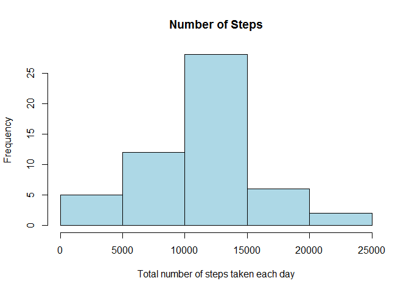
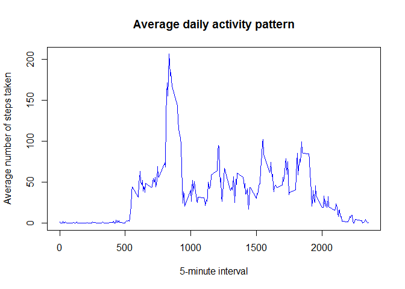
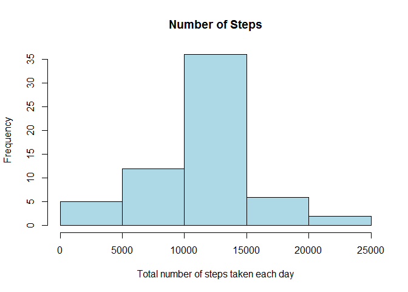
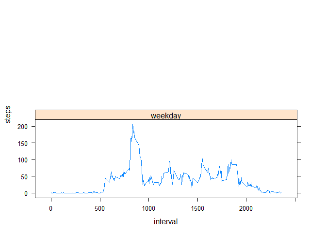

# Reproducible Research: Peer Assessment 1

This assignment makes use of data from a personal activity monitoring device. This device collects data at 5 minute intervals through out the day. The data consists of two months of data from an anonymous individual collected during the months of October and November, 2012 and include the number of steps taken in 5 minute intervals each day.

## Loading and preprocessing the data


```r
data <- read.csv("activity.csv", header=TRUE)
clean_data <- data[which(data$steps != "NA"), ]
```

## What is mean total number of steps taken per day?

Below is a histogram of the daily total number of steps taken, plotted with a bin interval of 5000 steps.


```r
library(plyr)
total_by_day <- ddply(clean_data, .(date), summarise, steps=sum(steps))
hist(total_by_day$steps, main="Number of Steps", 
     xlab="Total number of steps taken each day", col="light blue")
```

 

```r
# mean and median total number of steps taken per day
mean(total_by_day$steps)
```

```
## [1] 10766.19
```

```r
median(total_by_day$steps)
```

```
## [1] 10765
```

## What is the average daily activity pattern?

Below is a plot of the average daily pattern of the number of steps plotted against the interval number.


```r
average_by_interval <- ddply(clean_data, .(interval), summarise, steps=mean(steps))
plot(average_by_interval$interval, average_by_interval$steps, type="l", 
     col="blue",
     xlab="5-minute interval", 
     ylab="Average number of steps taken",
     main="Average daily activity pattern")
```

 

```r
# Which 5-minute interval, on average across all the days in the dataset, contains the maximum number of steps?
average_by_interval[average_by_interval$steps==max(average_by_interval$steps),]
```

```
##     interval    steps
## 104      835 206.1698
```

```r
colnames(average_by_interval)[2] <- "intervalAvg"
```

## Imputing missing values

To populate missing values, we choose to replace them with the mean value at the same interval across days. The choice is based on the assumption that activities usually follow a daily pattern.


```r
# Total number of missing values in the dataset
sum(is.na(data$steps))
```

```
## [1] 2304
```

```r
# Fill NA's with average for that 5-min interval
merged <- arrange(join(data, average_by_interval), interval)
```

```
## Joining by: interval
```

```r
# Create a new dataset that is equal to the original dataset but with the missing data filled in.
merged$steps[is.na(merged$steps)] <- merged$intervalAvg[is.na(merged$steps)]
# Histogram
new_total_by_day <- ddply(merged, .(date), summarise, steps=sum(steps))
hist(new_total_by_day$steps, main="Number of Steps", 
     xlab="Total number of steps taken each day", col="light blue",)
```

 

```r
# mean and median total number of steps taken per day
mean(new_total_by_day$steps)
```

```
## [1] 10766.19
```

```r
median(new_total_by_day$steps)
```

```
## [1] 10766.19
```

```r
total_steps1 <- sum(clean_data$steps)
total_steps2 <- sum(merged$steps)
total_diff <- total_steps2 -total_steps1 []
```

Mean values didn't change, because I supplied interval averge for the given interval, so total average didn't change. Histogram and median changed somewhat.

## Are there differences in activity patterns between weekdays and weekends?


```r
library(lattice)
weekdays <- weekdays(as.Date(merged$date))
data_weekdays <- transform(merged, day=weekdays)
data_weekdays$wk <- ifelse(data_weekdays$day %in% c("Saturday", "Sunday"),
                           "weekend", "weekday")
average_week <- ddply(data_weekdays, .(interval, wk), 
                      summarise, steps=mean(steps))

xyplot(steps ~ interval | wk, data = average_week, layout = c(1, 2), type="l")
```

 

We observe that activity on the weekends tends to be more spread out over the day compared to the weekdays. This could be due to the fact that activities on weekdays mostly follow a work related routine, whereas weekends tend to be more random.
